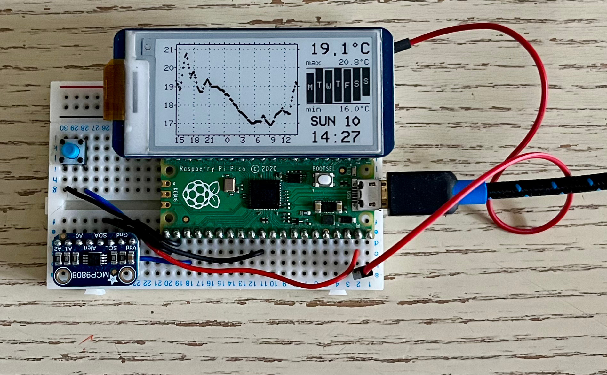

# picoPloT

Raspberry Pi Pico temperature recorder with a rolling plot on E-Paper display.

## Software dependencies

+ https://github.com/AnotherJohnH/Platform
+ arm-none-eabi-gcc
+ cmake
+ ninja (make works too)
+ SDL2 (for native test target)

Both Pico and native targets should build on MacOS or Linux.

## Status

Working but incomplete and has some bugs.

## Hardware information

For more information on the circuit above see the [schematic](https://github.com/AnotherJohnH/picoPloT/blob/main/docs/schematic_v0.01.pdf)

## How to build

### Checkout

This repo uses git sub-modules, so checkout using --recurse to clone all the
dependent source...

    git clone --recurse https://github.com/AnotherJohnH/picoPicoT.git

or

    git clone --recurse ssh://git@github.com/AnotherJohnH/picoPloT.git

### Build

Being developed on MacOS but should build fine on Linux too.

Indirect build of all supported targets (with cmake and ninja)...

    make

Build directly using cmake...

    mkdir build
    cd build
    cmake -DCMAKE_BUILD_TYPE=Release -DPLT_TARGET=rpipico -DCMAKE_TOOLCHAIN_FILE=Platform/MTL/rpipico/toolchain.cmake ..
    make

Flashable image will be found under the build sub directory here...

    .../Source/picoPloT.uf2

## License

This project is licensed under the MIT License - see the [LICENSE](LICENSE) file for details
